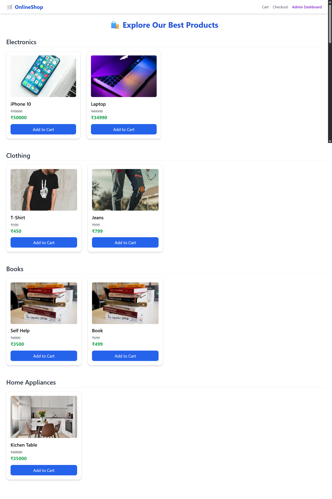
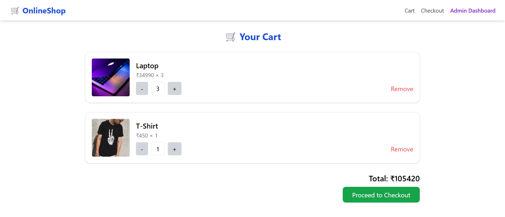
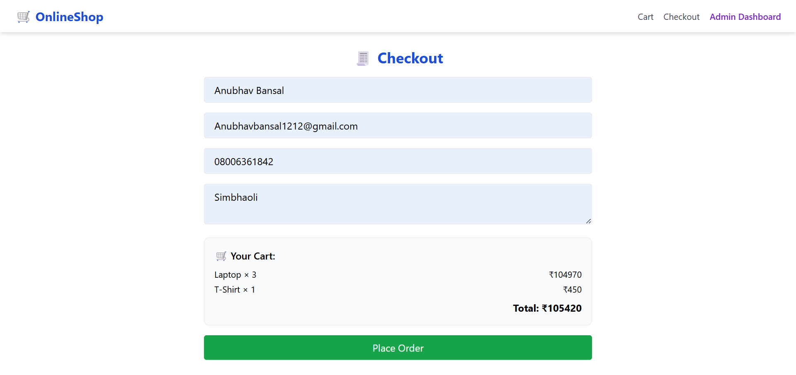
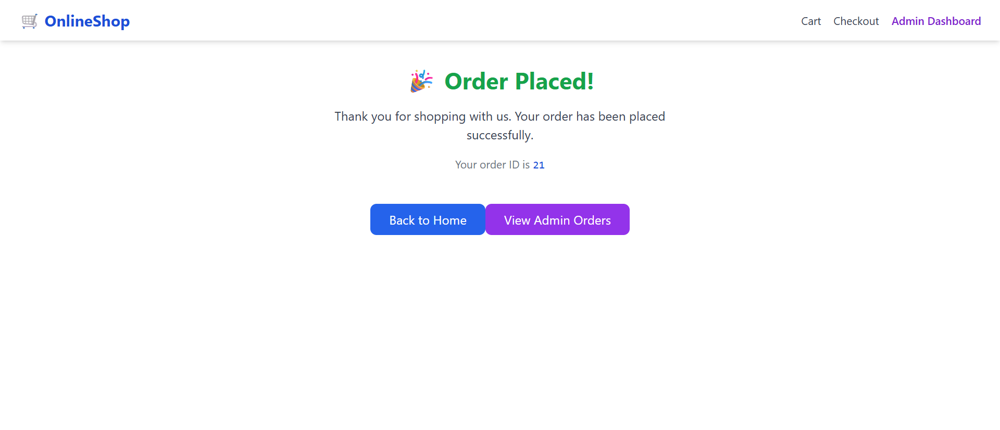
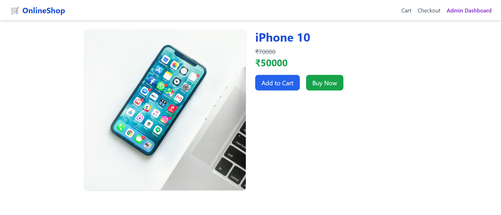

# 🛍️ OnlineShop – Full Stack E-Commerce App

A full-featured modern e-commerce application built with **React**, **Node.js**, **Express**, **Sequelize**, and **PostgreSQL**. This project supports product browsing, cart management, checkout flow, and admin order management — all with a mock login system for demonstration.

---

## Features

### Frontend (React + Tailwind CSS)

- Product listing categorized (Electronics, Books, Clothing, Home Appliances etc.)
- Product detail page
- Cart functionality (add, update quantity, remove)
- Checkout with customer details
- Success confirmation page after placing an order
- Protected checkout route
- Admin dashboard to view all orders
- Role-based navbar rendering (customer/admin)

### Backend (Node.js + Express + Sequelize)

- REST API with routes for:
  - Products (GET all, GET by ID)
  - Orders (GET all, GET by ID, POST new, PUT update status)
- Relational models: `Product`, `Category`, `Order`, `OrderItem`, `User`
- Sequelize + PostgreSQL with associations and migrations
- Mock login middleware to simulate roles (`admin`, `customer`)
- Role-based protection on sensitive routes (e.g., admin dashboard)

---

## Tech Stack

- Frontend: React, Tailwind CSS, React Router
- Backend: Node.js, Express.js
- ORM: Sequelize
- Database: PostgreSQL
- Dev Tools: Vite, Axios, React Toastify

---

## Mock Login Details

Since this is a demo, there's **no real authentication** — instead, the app uses a mock user system for simulating roles:

### How to Switch Roles:

**Frontend**
Edit `context/UserContext.jsx`:

```js
const mockUser = {
  id: 1,
  name: "Admin User",
  role: "admin", // Change to "customer" to simulate normal user
};

**Backend**
Edit `middleware/setUserRole.js`

req.user = {
  id: 1,
  name: "Admin User",
  role: "admin",    // Change to "customer" as needed
};
```

**Backend Setup**

cd ecommerce-backend
npm install
npx sequelize-cli db:migrate
npx sequelize-cli db:seed:all
npm run dev
Runs on: http://localhost:3000

**Frontend Setup**

cd ecommerce-frontend
npm install
npm run dev

Runs on: http://localhost:5173

| Route            | Access    |
| ---------------- | --------- |
| `/`              | Everyone  |
| `/product/:id`   | Everyone  |
| `/cart`          | Everyone  |
| `/checkout`      | Customer  |
| `/order-success` | Customer  |
| `/admin/orders`  | **Admin** |

**Folder Structure**

ecommerce-app/
├── ecommerce-backend/
│ ├── controllers/
│ ├── models/
│ ├── migrations/
│ ├── seeders/
│ ├── routes/
│ └── middleware/
└── ecommerce-frontend/
├── pages/
├── context/
├── components/
└── api/

**ScreenShot of all the pages**

**HomePage**


**Cart Page**


**Checkout Page**


**Order Placed Page**


**Admin Order Page**


**Order Detail Page**

